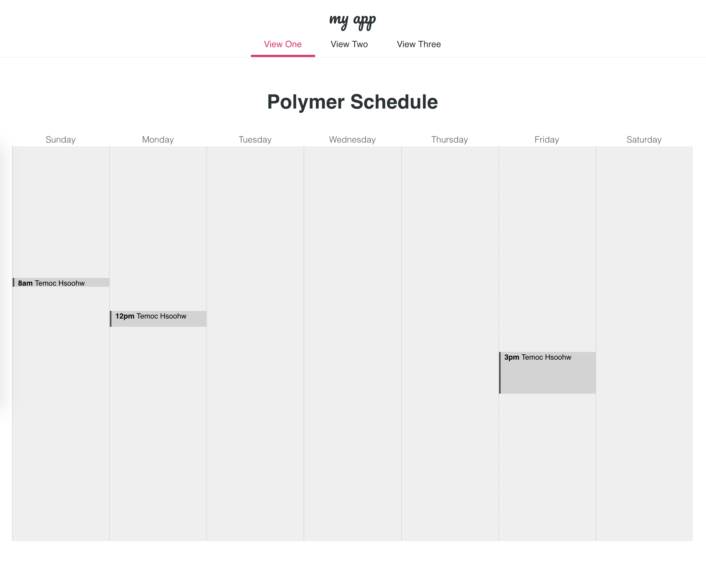

# Polymer Schedule

Scheduling app with Polymer.

This template is a starting point for building apps using a drawer-based
layout. The layout is provided by `app-layout` elements.

This template, along with the `polymer-cli` toolchain, also demonstrates use
of the "PRPL pattern" This pattern allows fast first delivery and interaction with
the content at the initial route requested by the user, along with fast subsequent
navigation by pre-caching the remaining components required by the app and
progressively loading them on-demand as the user navigates through the app.

The PRPL pattern, in a nutshell:

* **Push** components required for the initial route
* **Render** initial route ASAP
* **Pre-cache** components for remaining routes
* **Lazy-load** and progressively upgrade next routes on-demand